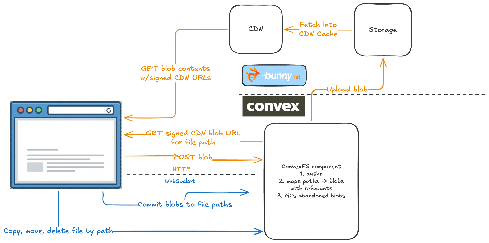

ConvexFS is a Convex component for uploading, managing, and serving files. It
provides path-based file organization—similar to S3—with APIs to copy, move, and
delete files.

File metadata (paths, content types, sizes) lives in Convex tables, while file
contents (**blobs**) are stored in [bunny.net](https://bunny.net) Edge Storage.
When your app serves files, it uses Bunny's global CDN with
[token authentication](https://docs.bunny.net/docs/cdn-token-authentication) for
secure, authorized access.

Here's the general layout of how Convex and bunny.net share responsibilities:

